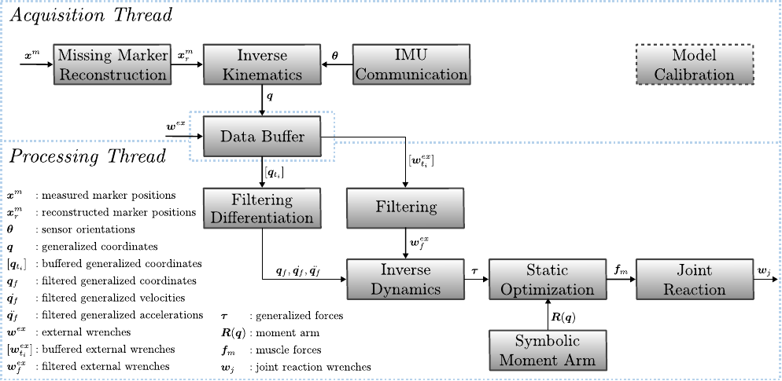
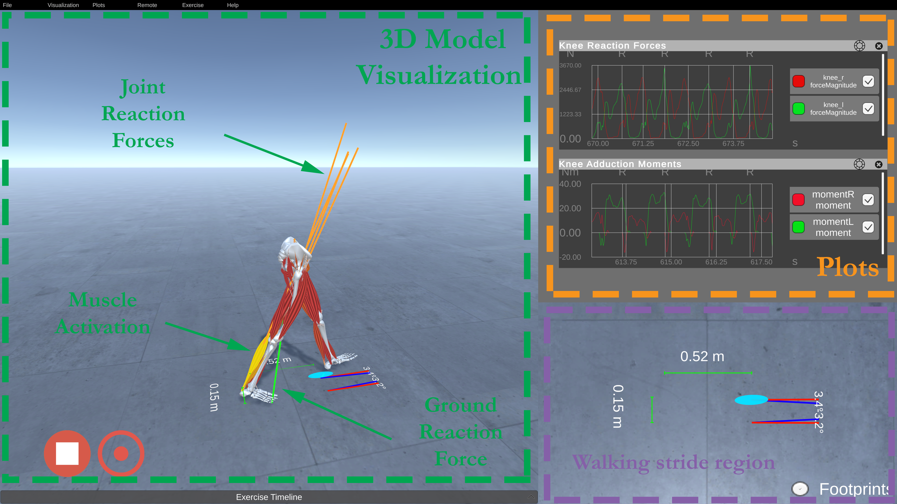
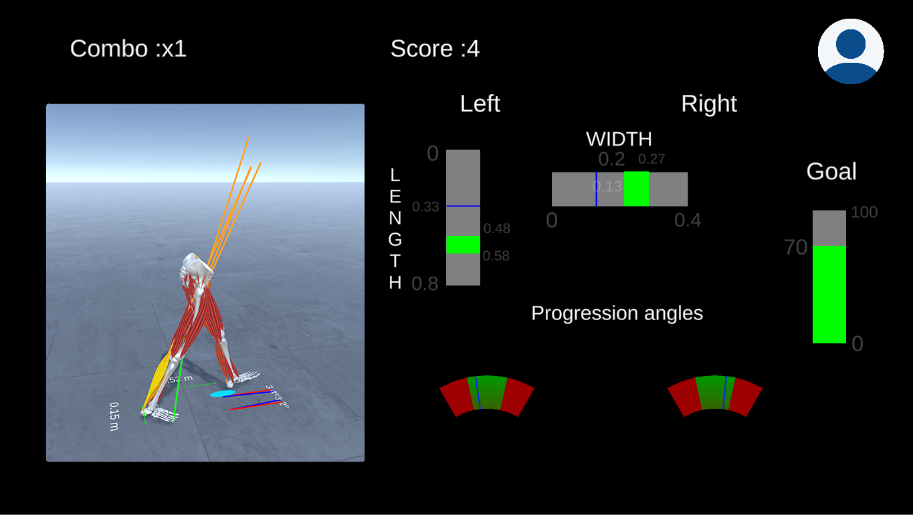

[](https://github.com/mitkof6/OpenSimRT/actions/workflows/continuous-integration.yml)

# OpenSimRT

*Real-Time Musculoskeletal Kinematics and Dynamics Analysis Using Marker- and
IMU-Based Solutions in Rehabilitation*


This project aims to explore the possibility of estimating a multitude of
kinematic and dynamic quantities using subject-specific musculoskeletal models
in real-time. The framework was designed to operate with marker-based and
inertial measurement units enabling extensions far beyond dedicated motion
capture laboratories. An overview of how different modules can be linked-to
calculate the joint reaction loads is presented below:



The basic operations presented in the above figure were re-implemented in a
manner that enables us to call them iteratively so that information can be
processed frame-by-frame. Emphasis was given that each algorithm is implemented
in a simple manner. Tests were performed to ensure that online and offline
results agree. We have used this pipeline to provide real-time biofeedback
during gait retraining to reduce the loading of the knee:





Relative projects:

- [RTOSIM](https://github.com/RealTimeBiomechanics/rtosim)
- [CEINMS](https://simtk.org/projects/ceinms/)
- [Motekmedical HBM](https://www.motekmedical.com/software/hbm/)

## Organization

The project is organized into sub-modules. Each sub-module contains the code,
tests, and applications. In the test files, we perform unit tests of each
sub-component. There you can find more information on how to use the different
tools developed. For example, if you are interested in performing inverse
kinematics with IMU, you can check
`/OpenSimRT/IMU/tests/TestLowerLimbIKFromFile.cpp`. The organization is as
follows:

- `OpenSimRT/Common`: a module containing common utilities such as circular
  buffer, dynamic library loader, exceptions, serialization, real-time filters,
  visualization, sensor synchronization manager, and other useful functions.
- `OpenSimRT/IMU`: a data synchronization interface NGIMU sensors, unit tests,
  and applications that demonstrate how to stream data and perform inverse
  kinematics.
- `OpenSim/RealTime`: contains the developed algorithms for performing real-time
  calculations. That includes inverse kinematics, inverse dynamics, muscle
  optimization, joint reaction analysis, and ground reaction forces
  prediction. You can find the `tests` folder very useful to understand how one
  can use individual modules. In the `applications` you will find an example that
  links multiple modules together.
- `OpenSim/Vicon`': an interface with Vicon data streamer.


The `data` folder contains OpenSim models (upper and lower limb) and files used
to test the developed algorithm. It also contains a `setup.ini` file with the
settings of the algorithms during testing. Each model (e.g., `gait1992`) is
organized into sub-folders with specific name conventions to automate migration
to different models. For example, experimental data are placed into the
`experimental_data` folder. Results from offline OpenSim analyses are placed
into `scale`, `inverse_kinematics`, `inverse_dynamics`,
`residual_reduction_algorithm`, `static_optimziation`,
`computed_muscle_control`. The `real_time` folder contains results from the
tests of different sub-modules. The `scripts` sub-folder contains automatic
Python scripts that compare real-time and offline results and generate files
into the corresponding folders. Finally, `real_time/moment_arm` contains Python
auto-generated C++ code for calculating the moment arm matrix (pre-computed
symbolic representation) that is linked on runtime depending on the model being
used.

## Dependencies

This project depends on several libraries:

- [opensim-core](https://github.com/opensim-org/opensim-core) and we have
  tested with [branch](https://github.com/mitkof6/opensim-core/tree/bindings_timestepper).
- If you plan to use the `Vicon` module please use
  [ViconDataStreamSDK_1.7.1](https://www.vicon.com/software/datastream-sdk/?section=downloads).
- If you plan to use the `IMU` module that uses [NGIMU x-io Technologies
   Limited](https://x-io.co.uk/ngimu/) please build the
   [oscpack](https://github.com/mitkof6/oscpack).

For more information on how to build and set up these dependencies, please look
at the continuous integration script (`.github/workflows/`) and the
`dependencies` folder. To run the tests and examples that use files as inputs
instead of streams, you will only need `opensim-core`.

## Acknowledge

If you find this useful you can acknowledge it as follows:

```bibtex
@Article{s21051804,
AUTHOR = {Stanev, Dimitar and Filip, Konstantinos and Bitzas, Dimitrios and Zouras, Sokratis and Giarmatzis, Georgios and Tsaopoulos, Dimitrios and Moustakas, Konstantinos},
TITLE = {Real-Time Musculoskeletal Kinematics and Dynamics Analysis Using Marker- and IMU-Based Solutions in Rehabilitation},
JOURNAL = {Sensors},
VOLUME = {21},
YEAR = {2021},
NUMBER = {5},
ARTICLE-NUMBER = {1804},
URL = {https://www.mdpi.com/1424-8220/21/5/1804},
ISSN = {1424-8220},
ABSTRACT = {This study aims to explore the possibility of estimating a multitude of kinematic and dynamic quantities using subject-specific musculoskeletal models in real-time. The framework was designed to operate with marker-based and inertial measurement units enabling extensions far beyond dedicated motion capture laboratories. We present the technical details for calculating the kinematics, generalized forces, muscle forces, joint reaction loads, and predicting ground reaction wrenches during walking. Emphasis was given to reduce computational latency while maintaining accuracy as compared to the offline counterpart. Notably, we highlight the influence of adequate filtering and differentiation under noisy conditions and its importance for consequent dynamic calculations. Real-time estimates of the joint moments, muscle forces, and reaction loads closely resemble OpenSim’s offline analyses. Model-based estimation of ground reaction wrenches demonstrates that even a small error can negatively affect other estimated quantities. An application of the developed system is demonstrated in the context of rehabilitation and gait retraining. We expect that such a system will find numerous applications in laboratory settings and outdoor conditions with the advent of predicting or sensing environment interactions. Therefore, we hope that this open-source framework will be a significant milestone for solving this grand challenge.},
DOI = {10.3390/s21051804}
}
```

*Funding*

This work was supported by the EC Horizon 2020 project OACTIVE: Advanced
personalized, multi-scale computer models preventing osteoarthritis, Grant
Agreement No. 777159 (http://oactive.eu/).
